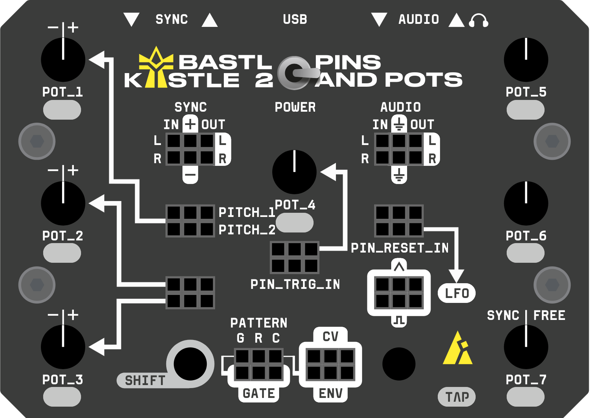

# Kastle 2 Glossary & Examples

## App 

A complete firmware application that runs on your Kastle 2. Each app inherits from the virtual `App` base class and implements four core methods:

- `Init()` - setup resources, configure Base features
- `DeInit()` - cleanup and resource deallocation  
- `AudioLoop()` - real-time audio processing (marked with FASTCODE)
- `UiLoop()` - user interface, potentiometer readings, LED control

Apps have unique IDs for EEPROM persistence and automatic memory management. The main.cpp workflow follows this pattern:

```cpp
int main() {
    Kastle2::Init();
    Kastle2::RegisterApp(&app);
    app.Init();
    Kastle2::StartAudio(process_audio);
    
    while (true) {
        Kastle2::ReadInputs();
        app.UiLoop();
    }
}
```

Optional methods include `SecondCoreWorker()` for dual-core processing, `MidiCallback()` for MIDI handling, and `MemoryInitialization()` for first-time setup. Examples include FxWizard (effects processor), WaveBard (sample player), ExampleSynth (simple synthesizer), Calibration (pitch input V/Oct calibration) and Template (to start projects from scratch).

## Base

Essential foundation layer that provides core functionality for all Kastle 2 firmware applications. Manages hardware abstraction including input/output volumes, LFO generation, sequencer with multiple rhythm patterns, clock with sync capabilities, layer switching (normal/shift/mode), and CV/Gate outputs.

Features can be selectively disabled for custom control:

```cpp
// Common feature disabling examples
Kastle2::base.SetFeatureEnabled(Base::Feature::AUDIO_CHAIN, false);  // Handle mixing manually
Kastle2::base.SetFeatureEnabled(Base::Feature::ENV_OUT, false);      // Disable envelope follower output, control the pin directly
Kastle2::base.SetFeatureEnabled(Base::Feature::LFO_OUT, false);      // Use LFO pins for custom purposes
```

Provides three critical audio processing hooks: `BeforeAudioLoop()` (handles input gain, LFO/clock stepping), the app's AudioLoop(), and `AfterAudioLoop()` (applies output gain, audio chain mixing).

Access subsystems through dedicated getters for advanced control:

```cpp
Kastle2::base.GetSequencer().SetLength(16);
Kastle2::base.GetLfo().SetFrequency(2.5f);
Kastle2::base.GetClock().IsNowTrigger();
```

## CV and Digital IO

**Reading inputs:**
- **CV inputs**: Range 0-4095 representing 0-5V on Kastle 2 (can be -4095 to +5733 on Citadel meaning -5V to +7V range)
- **Digital inputs**: Boolean values (true/false)
- **Dual inputs**: `TRIG_IN` and `RESET` can be read both as analog CV (0-4095) and digital trigger (true/false)

**Writing outputs:**
- **CV outputs**: Range 0-1023 representing percentage of available voltage (depends on power source)
- **Digital outputs**: Boolean values, ones and zeros

```cpp
// Read CV inputs (0-4095 = 0-5V)
int32_t pitch_cv = Kastle2::hw.GetAnalogValue(Hardware::AnalogInput::PITCH_1);
int32_t param_cv = Kastle2::hw.GetAnalogValue(Hardware::AnalogInput::PARAM_1);

// Read digital inputs
bool trigger_in = Kastle2::hw.GetDigitalIn(Hardware::DigitalInput::TRIG_IN);
bool reset_in = Kastle2::hw.GetDigitalIn(Hardware::DigitalInput::RESET_IN);
bool trigger_in2 = Kastle2::hw.GetTrigIn();  // Shorthand for TRIG_IN

// Dual inputs - can be read both analog and digital
int32_t trigger_cv = Kastle2::hw.GetAnalogValue(Hardware::AnalogInput::TRIG_IN); 
int32_t reset_cv = Kastle2::hw.GetAnalogValue(Hardware::AnalogInput::RESET);     

// Write digital outputs
Kastle2::hw.SetGateOut(true); // Send gate signal
Kastle2::hw.SetDigitalOut(Hardware::DigitalOutput::SYNC_OUT, false);

// Write analog outputs (0-1023 as percentage of max voltage)
Kastle2::hw.SetAnalogOut(Hardware::AnalogOutput::ENV_OUT, 512);  // ~50% of max voltage
```

*Note: Analog output voltage depends on power source (3×AA batteries vs USB), so use values as percentages rather than absolute voltages.*

 

## Debug Pins

Debug pins provide hardware-level performance monitoring and debugging capabilities. The primary debug pin is exposed as TX (GPIO0) and is commonly used to monitor audio loop performance timing when `MEASURE_AUDIO_LOOP` is enabled in the config file.

```cpp
// Toggle debug pin for performance measurement
Kastle2::hw.SetDebugPin(0, 1);  // Set pin high
// ... code to measure ...
Kastle2::hw.SetDebugPin(0, 0);  // Set pin low
```

A second debug pin (GPIO1/RX) is available but requires disabling UART MIDI functionality since the pin is primarily used for the MIDI input.

## DSP and Utilities

The Kastle 2 source code includes a comprehensive collection of DSP classes and utility functions for audio processing, synthesis, effects, and control. The classes are specifically optimized for the fixed-point arithmetic system.

**Common DSP classes include:**
- **Synthesis**: Oscillator, MultiOutOscillator...
- **Filters**: Svf, DjFilter...
- **Effects**: BitCrusher, StereoDelay, SoftClipper, HardClipper...
- **Control**: AdsrEnv , EnvelopeFollower...
- **Sampling**: SamplePlayer...
- **Utilities**: Quantizer, AutoFreeze, Portamento...

Most DSP classes follow a standard pattern with `Init(sample_rate)` for setup and `Process()` methods for real-time audio processing. All audio processing functions are marked with `FASTCODE` for optimal performance and use Q15/Q31 fixed-point arithmetic throughout.

## EnumArray&lt;T&gt;

A safe and efficient enum-indexed array template class that allows using enum values as array indices. The enum must have a `COUNT` value to determine the size of the array. Provides type-safe array access using enum values instead of raw integers, making code more readable and preventing indexing errors.

```cpp
enum class Mode { DELAY, FLANGER, CRUSHER, COUNT };

// Declaration with initialization
EnumArray<Mode, uint32_t> led_colors = {
    WS2812::GREEN,    // Mode::DELAY
    WS2812::CYAN,     // Mode::FLANGER  
    WS2812::YELLOW    // Mode::CRUSHER
};

// Safe access using enum values
led_colors[Mode::DELAY] = WS2812::RED;

// Iterate directly through the array
for (auto &color : led_colors) {
    ProcessColor(color);
}

// Iterate through all enum values with EnumRange
for (Mode mode : EnumRange<Mode>()) {
    IndicateMode(mode);
}

// Cycle through enum values with EnumIncrement
Mode current_mode = Mode::DELAY;
current_mode = EnumIncrement(current_mode);  // Now Mode::FLANGER
```

## DirtyInputsHandler

Template class for handling ADC inputs where you need to be 100% sure they have the latest values (usually for sample & hold operations). When triggered, it flags specified analog inputs as "dirty" forcing fresh ADC reads, then waits until all inputs have been refreshed before allowing the trigger to proceed. Essential for time-critical operations where stale ADC values could cause audio artifacts and inconsistent sequences.

## FancyMode

High-level abstraction for mode switching with advanced features including MIDI support, memory saving/loading, CV control with attenuating, and smart mode change prevention when tweaking parameters while holding MODE button.

Key features:
- **Multi-source input**: Can read value based on button presses or MIDI sources (CCs, notes)
- **Handles modulation**: CV input with configurable attenuator for voltage control
- **Memory persistence**: Automatically saves/restores values from EEPROM


```cpp
// Declaration with configuration
FancyMode mode_selector_ = FancyMode(FancyMode::Config{
    .memory_addr = kMemMode,
    .modes_count = static_cast<size_t>(Mode::COUNT),
    .midi_cc = cc::MODE,
    .adc_input = Hardware::AnalogInput::MODE
});

// In Init()
mode_selector_.Init(static_cast<size_t>(Mode::COUNT));

// Call in AudioLoop() for proper timing
mode_selector_.Process();

// Call in UiLoop() to read inputs  
mode_selector_.ReadValue();
uint32_t current_mode = mode_selector_.GetMode();
```

## FancyPot

Advanced potentiometer control class that provides MIDI integration, memory persistence, movement detection, and multi-layer support.

Key features:
- **Multi-source input**: Can read values from physical pots or MIDI sources (CCs, notes)
- **Movement detection**: Distinguishes between small tweaks vs large parameter changes
- **Memory persistence**: Automatically saves/restores values from EEPROM
- **Layer support**: Reads the pot only if a specific layer is selected

```cpp
// Declaration with configuration
std::unique_ptr<FancyPot> feedback_pot_ = FancyPot::Create({
    .pot = Hardware::Pot::POT_2,
    .layer = Hardware::Layer::SHIFT,
    .initial_value = pot(0.75f),  // 75% using compile time constructor
    .midi_cc = cc::FEEDBACK,
    .deadzone = true, // Center deadzone (pots aren't ideal)
    .freeze = true,    // Useful for filtering out noise
    .memory_addr = kMemFeedback
    // ...     
});

// In Init()
feedback_pot_->Init(AUDIO_LOOP_RATE);

// Call in AudioLoop() for proper timing
feedback_pot_->Process();

// Call in UiLoop() to read pot/MIDI values
feedback_pot_->ReadValue();
if (feedback_pot_->HasChanged()) {
    // Receive value in 0-4095 range
    int32_t feedback_value = feedback_pot_->GetValue();
}
```

## FASTCODE

A compiler attribute that marks functions to be placed in a special `.fastcode` section in the binary. This code is copied from external QSPI flash to RAM at startup for speed improvements. Running code from RAM also prevents unpredictable caching behavior that can occur when pushing the chip to its performance limits, ensuring consistent timing for real-time audio processing.

The fastcode section is limited to 16 kB due to the RP2040's constrained RAM space, use it only for functions which need crucial timings.

## map

Core mapping function that transforms values from one range to another with linear scaling, similar to Arduino's `map()` function but with advanced safety features. Can map between different numeric types (int, float, etc.) with automatic type promotion.

Supports two important safety modes:
- **MapSafe** - uses 64-bit math to prevent integer overflow for large numbers (ignored for floating-point types); slower than the default 32-bit but necessary for Q31 computations
- **MapClamp** - constrains output to target range vs allowing extrapolation

```cpp
// Basic usage: map pot value (0-4095) to frequency (20-20000 Hz)
float freq = map(pot_value, 0, 4095, 20.0f, 20000.0f);

// With safety features
int32_t safe_result = map(large_value, 0, 1000000, 0, 32767, MapClamp::TRUE, MapSafe::TRUE);
```

## MapDef&lt;T, N&gt;, curve_map()

**MapDef** is a compile-time mapping table template that stores input and output value arrays for creating custom parameter curves. Used with **curve_map()**, **enum_map()** and **step_map()** functions to perform linear interpolation between defined points, enabling complex response curves like exponential, logarithmic, or custom shapes while maintaining efficient performance.

Unlike the basic `map()` function, `curve_map()` and others support non-linear mappings by interpolating between user-defined breakpoints:

```cpp
// Define a custom distortion curve
static constexpr auto kMapDistortionAmount = MapDef<int32_t, 5>{
    {pot(0.0f), pot(0.55f), pot(0.85f), pot(0.95f), pot(1.0f)},  // Input breakpoints
    {q15(0.0f), q15(0.0f), q15(0.04f), q15(0.25f), q15(0.6f)}   // Output values
};

// Apply the curve mapping
q15_t distortion = curve_map(pot_value, kMapDistortionAmount);
```

## q15_t, q31_t, q31_add(), q15_mult()...

Since the RP2040 lacks a dedicated FPU (floating-point unit), float operations are slow due to software emulation. To maximize performance, we use a fixed-point arithmetic system wherever possible, representing values from -1.0 to +1.0. This approach enables relatively complex DSP functionality on the RP2040 microcontroller, even with its limited hardware resources.

**Q15 format**: 1.15 format (1 sign bit, 15 fractional bits) for simpler calculations (eg. filter)  
**Q31 format**: 1.31 format (1 sign bit, 31 fractional bits) for higher precision calculations (eg. envelope)

Common operations include:

```cpp
q15_t gain = q15(0.5f);                       // Compile-time constructor
q15_t result = q15_mult(signal, gain);        // Multiplication with saturation
q15_t sum = q15_add(left, right);             // Addition with overflow protection  
q15_t safe = q15_saturate(large_value);       // Clamp to valid range
q31_t precise = q15_to_q31(q15_value);        // Format conversion
```

**Performance optimization**: Fixed-point arithmetic requires calculations in double bit-width (16-bit Q15 operations need 32-bit intermediate results, while 32-bit Q31 operations need 64-bit intermediates). This is why Q15 is preferred over Q31 on the RP2040 - it stays within efficient 32-bit math.

Q15 values are stored as `q15_t` (32-bit) rather than native 16-bit to avoid memory padding overhead on the RP2040's 32-bit ARM architecture. When the compiler stores 16-bit values, it must pad them to 32-bit boundaries during calculations, which takes extra CPU cycles.

When memory conservation is critical (e.g., large delay lines), use `q15least_t` for actual 16-bit storage. This design provides the ideal balance between computational efficiency and memory usage for real-time audio processing.

*Note: We tested the official ARM CMSIS-DSP library and in real usage it was slower than our custom implementation.*

## ShiftTrigger

Utility function that detects when the SHIFT button was quickly pressed and released (short press). Returns `true` when the previous layer was SHIFT, current layer is NORMAL, and the layer timer is less than the short press threshold. It works in symbiosis with FancyPot and layer switching - quick triggers and turning eg. Sample Pot on WaveBard won't change the Filter.

```cpp
void AppExample::UiLoop() {
    // Check for quick SHIFT press to trigger an action
    if (ShiftTrigger()) {
        // Perform quick action (e.g., tap tempo, reset parameter, etc.)
        TriggerEnvelope();
    }
    
    // Normal layer handling
    if (Kastle2::hw.GetLayer() == Hardware::Layer::SHIFT) {
        // SHIFT is held down - show alternate UI, different parameters
        ShowShiftLayerUi();
    } else {
        // Normal layer operation
        ShowNormalUi();
    }
}
```

## Test Mode

Diagnostic and testing system incorporated into every Kastle 2 firmware. Users can enter test mode by holding the MODE button during startup. At the beginning the current firmware version is announced. Then the test mode runs automated tests that verify hardware functionality, including audio I/O, potentiometer readings, button responses and patchbay.

See [kastle2-test-mode-patch.pdf](kastle2-test-mode-patch.pdf) for detailed patching instructions.

## Universal Firmware (Kastle 2 / Citadel)

Starting with firmware version 1.5, we added Citadel support to existing Kastle 2 releases. Having a single firmware release greatly simplifies testing, maintenance, and communication—saving us considerable time and effort. While the core functionality remains identical between the two devices, the ADC mappings and calibrations differ because the Citadel features an expanded CV input range. 

When developing the code, most of the time you don't need to care if your app runs on Kastle 2 or Citadel. In case you'd need to know it, there is a function for that.

```cpp
auto version = Kastle2::hw.GetVersion();
// returns either Hardware::Version::KASTLE2 or Hardware::Version::CITADEL
```

Due to the limited number of I/O pins, we chose to reuse the TRS MIDI RX pull-up resistor for device detection. This approach effectively solved the auto-detection challenge, but it comes with one limitation:
**you cannot retrofit an existing Kastle 2 with MIDI support while using the official Kastle 2 firmwares**, as doing so would cause the input mappings to be incorrect. If you want to use TRS MIDI alongside a 0–5V CV system, you’ll need to adapt your schematic to correctly invert and shift the analog input levels. Or compile your custom firmware with the usage of `Hardware::ForceVersion()` method.

## VersionChainGenerator

Compile-time utility class that generates audio sample chains from version strings for the test mode. Translates version strings like "1.2" into arrays of audio samples like ["app_name", "version", "one", "point", "two"]. Uses template metaprogramming to build the sample chain at compile time, enabling the device to speak its version number and app name during testing and diagnostics.

