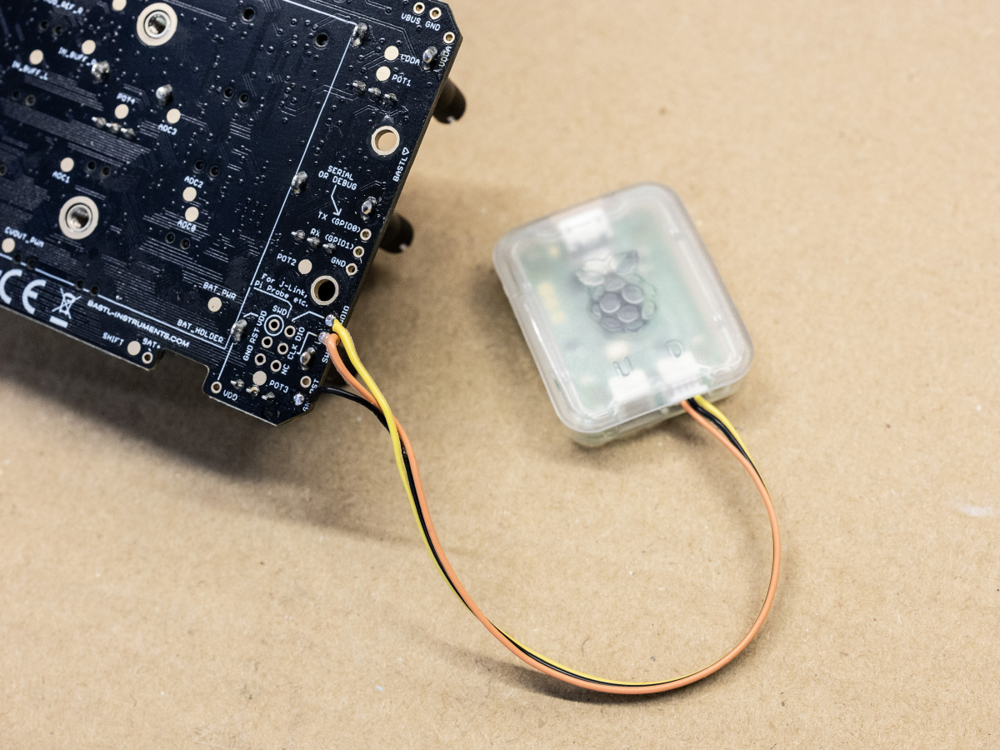
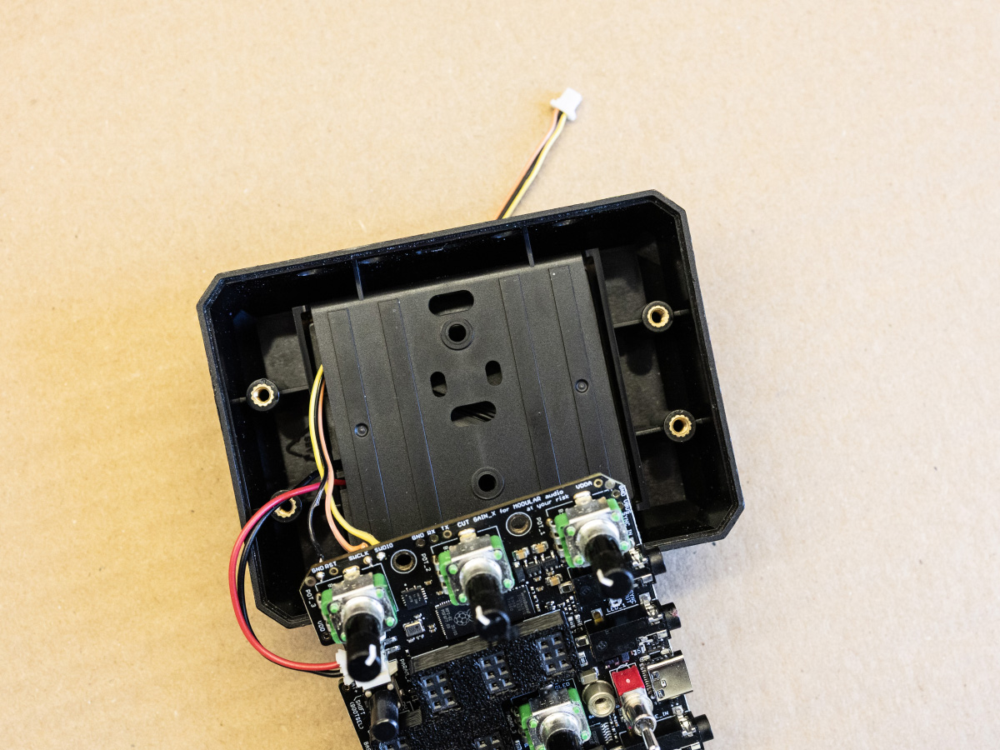
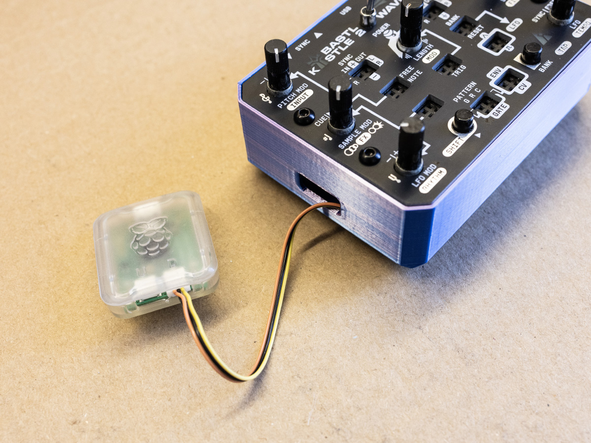

# Kastle 2 Toolchain Install Guide

## Introduction

You need to install GIT, Python 3, CMake, GNU Embedded Toolchain for ARM, Picotool (optional) and Doxygen (optional). For the development itself we recommend using VS Code, but you can use any editor/environment you like.

For beginners, we recommend the [Automated Install](#automated-install-nix); for advanced users who regularly develop for ARM, we recommend the [Manual Install](#manual-install).

## Clone the GitHub repository

The starting point for both installation methods.

```
git clone https://github.com/bastl-instruments/kastle2.git
```

## Automated Install (Nix)

The easiest way to get started is with Nix — an isolated development environment that automatically installs all the requirements. It runs natively on macOS/Linux and won't interfere with your existing system tools. Thanks very much to [@euphemism](https://github.com/euphemism) for creating the Nix‑based development setup.

### Nix install
Make sure Nix is installed (check with `nix --version`). If it's not, install it from the [official website](https://nixos.org/download/).  
Enable Flakes by adding this line to `~/.config/nix/nix.conf`:
```
experimental-features = nix-command flakes
```

### Using the Nix shell

Go into the `kastle2` folder and start the Nix development environment. The first setup may take a few minutes, subsequent shells are fast.
```
nix develop .#
```
This shell automatically runs `./configure.sh` on first use (when the build folder doesn't exist).  
Go into `code/build` and run `make` to build all firmwares or `make <app-name>` to build a specific one.  
Launch your editor from within the Nix shell so it inherits the environment variables.

```
cd code/build

make wave-bard
make wave-bard-with-samples

code
```

You can find the compiled firmwares inside `code/build/output`.  
If you successfully installed the Kastle 2 Development shell, jump to the [Debugging section](#debugging) to continue.


## Manual Install

If you have already ARM Toolchain installed make sure it's version `14.2.1 20241119` or above by running:
```
arm-none-eabi-gcc --version
```

In case you have more than one ARM Toolchains installed (eg. you are using Daisy Toolchain), you can run this to get the specific one for the Raspberry Pi Pico platform:
```
$PICO_TOOLCHAIN_PATH/arm-none-eabi-gcc --version
```

#### MacOS (brew)

Make sure you have [Homebrew](https://brew.sh/) installed.
Then run these.

```
brew install cmake git python picotool doxygen
brew install --cask gcc-arm-embedded
```

If `gcc-arm-embedded` install through brew fails, download the ARM Toolchain manually from the [official ARM website](https://developer.arm.com/downloads/-/arm-gnu-toolchain-downloads). Select the `arm-none-eabi` and your platform (macOS x86_64, macOS Apple sillicon). Download the archive, extract it eg to `/Users/username/arm_kastle`. Then add this into `~/.zshrc`:
```
export PICO_TOOLCHAIN_PATH=/Users/username/arm_kastle/bin
```


#### Linux (apt – Ubuntu/Debian)

```
sudo apt update
sudo apt install git cmake gcc-arm-none-eabi libnewlib-arm-none-eabi build-essential libstdc++-arm-none-eabi-newlib doxygen
```

If you want to upload the code automatically using USB, download and build `picotool` using this tutorial:  https://github.com/raspberrypi/picotool You can find a detailed tutorial how to build it in [Getting started with Pico](https://datasheets.raspberrypi.com/pico/getting-started-with-pico.pdf) document, around page 25.

If you are running Ubuntu, you need to be on version 25 (Questing Quokka) or later for apt to install the correct version of the ARM Toolchain. If upgrading a WSL Ubuntu install, it may be necessary to [remove the `snapd` package](https://askubuntu.com/questions/1428423/upgrade-ubuntu-in-wsl2-from-20-04-to-22-04) before upgrading. 

#### Linux (pacman – Arch)

```
sudo pacman -Syu
sudo pacman -S git cmake arm-none-eabi-gcc arm-none-eabi-newlib doxygen
```

#### Windows

The easiest way is to follow the [Raspberry Pi Pico-series guide](https://datasheets.raspberrypi.com/pico/getting-started-with-pico.pdf).

### Get the Raspberry Pi Pico SDK

This applies to MacOS and Linux installations.

Kastle 2 is compatible both with the original Pico SDK 1.x and new 2.x. We strongly recommend to use the latest 2.x release to make sure everything works.
Navigate to a folder you want the SDK to be downloaded and clone the repository:

```
git clone https://github.com/raspberrypi/pico-sdk.git
```

Inside this folder, run this command in order to download additional libraries.

```
git submodule update --init
```

In your environment set PICO_SDK_PATH to the SDK location.

#### Linux

Add this line into `~/.bashrc`. Tilde symbol `~` is your user's home directory. If the file doesn't exist, create it.
```
export PICO_SDK_PATH=/path/to/your/pico-sdk
```

#### Mac OS
Add this line into `~/.zshrc`. Tilde symbol `~` is your user's home directory. If the file doesn't exist, create it.
```
export PICO_SDK_PATH=/path/to/your/pico-sdk
```

### Configure and compile it

#### VS Code

If you used VS Code for editing `.zshrc` or `.bashrc` file, restart it for the `export` to make effect.

Open the whole project folder (not just `code` subfolder) and run task called `configure`. Or use CMake extension to configure it. Then you can run `build_and_upload_usb` to upload the code into Kastle 2 via USB. If the USB upload doesn't work, turn off the Kastle 2 and hold SHIFT and power it on to enter the bootloader mode. Or use `build_and_upload_jlink` for J-Link upload. See section below for the available debuggers.

#### Or run configure.sh
```
./configure.sh
```
#### Or manually run this
```
mkdir code/build
cd code/build
cmake -DCMAKE_BUILD_TYPE=Debug ..
make
```
And then copy `code/build/output/kastle2-xxxx.uf2` manually onto the Kastle 2 mounted as USB drive.

If you want to compile just a single project, just type in `make template` or `make wave-bard`.

## Debug vs Release builds

At Bastl we use the `-O3` optimization flag even for Debug builds, because we can't run the existing code without optimizations. The builds also include `-g` for debug symbols. Since our development and testing time is limited, we usually don't bother recompiling the code using the Release flag, because we would need to retest every feature and sound signature all over again to make sure everything runs correctly.

## Debugging

Real-time code stepping and debugging is possible while the code is being executed. For that, Kastle 2 needs to be connected via SWD interface (SWDIO, SWCLK...) on the bottom side of the PCB. For each debug pin the PCB contains two locations to choose from (only one needs to be connected). This method also lets you upload firmware faster than UF2 method using USB.

We have predefined profiles for the [Raspberry Pi Debug Probe](https://www.raspberrypi.com/documentation/microcontrollers/debug-probe.html) and [Segger J-Link](https://www.segger.com/products/debug-probes/j-link/models/j-link-base/). In case you have an experience with other probes, feel free to write us with your experience and we can add it to the list.

If you don't have any probe and you have a Raspberry Pi Pico laying around, you can make your own probe using it. You can follow eg. [this tutorial](https://www.youtube.com/watch?v=0i2gLeBal9Y).

### Connections

Solder cable to the pins depending on your platform.

> [!WARNING]
> Soldering the connector and other board modification void the official warranty and you do it at your own risk.

**Raspberry Pi Debug Probe** requires: SWDIO, SWCLK, GND.  
**Segger J-Link Debug Probe** requires: SWDIO, SWCLK, GND, VDD, RESET.

#### This image shows the Raspberry Pi Debug Probe:

 

#### Run the cable under the battery holder:

 

#### Or 3D print the provided Kastle 2 enclosure, so you can access the cable easily without drilling the original enclosure:

 

### Citadel

For wiring the Citadel follow the instructions at the [Citadel README file](https://github.com/bastl-instruments/citadel/blob/main/README.md).


### VS Code
Make sure you have [Cortex Debug](https://marketplace.visualstudio.com/items?itemName=marus25.cortex-debug) extension installed. Go to `Run and Debug` section and select `J-Link Debug` or `Pico Probe` according to which of debug probes you have. Starting the debug process automatically builds the code and uploads it to the Kastle 2.

## Docs

The generated documentation is hosted here: [Kastle 2 Code Documentation](http://apps.bastl-instruments.com/kastle2-docs)

For building your own, run VS Code command `make_docs` or cd manually into `code` folder and run `doxygen` command.

The docs are located in `code/docs/output` and are in gitignore to keep the repository clean.